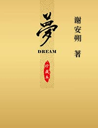

# Dream

By Anshuo Xie

October 1, 2017

---

* [Read](https://xieanshuo.gitbooks.io/dream/en)
  * [Download PDF](https://www.gitbook.com/download/pdf/book/xieanshuo/dream?lang=en) ｜ [Download Mobi](https://www.gitbook.com/download/mobi/book/xieanshuo/dream?lang=en) ｜ [Download Epub](https://www.gitbook.com/download/epub/book/xieanshuo/dream?lang=en)

* [简体中文在线阅读](https://xieanshuo.gitbooks.io/dream/zh)
  * [下载PDF](https://www.gitbook.com/download/pdf/book/xieanshuo/dream?lang=zh) |   [下载Mobi](https://www.gitbook.com/download/mobi/book/xieanshuo/dream?lang=zh) |   [下载ePub](https://www.gitbook.com/download/epub/book/xieanshuo/dream?lang=zh)

* [繁体中文在線閱讀](https://xieanshuo.gitbooks.io/dream/tw)
  * [下載PDF](https://www.gitbook.com/download/pdf/book/xieanshuo/dream?lang=tw) |   [下載Mobi](https://www.gitbook.com/download/mobi/book/xieanshuo/dream?lang=tw) |   [下載ePub](https://www.gitbook.com/download/epub/book/xieanshuo/dream?lang=tw)

---

## 

## About this Book

**“Dream”** is the Ultimate Reality untouchable by the mind and consciousness.

It is the perfect combination of the Buddha-mind and the Buddha Truth and is the unobstructed interfusion of the path of cultivation and the method of practical realization.

It contains the Mind-Seal of the Buddhas as well as supreme blessings, and it has the fundamental power of restoring the primitive standard of life.

It is the path for the return of the soul and behind the writing, there is power, luminosity, wisdom for the liberation of life, and the compassion for pacifying the soul, capable of unlocking the primal awareness in the souls of sentient beings.

---

## Licenses

[Creative Commons Attribution-NonCommercial-NoDerivatives 4.0 International\(CC BY-NC-ND 4.0\)](https://creativecommons.org/licenses/by-nc-nd/4.0/deed.en)

